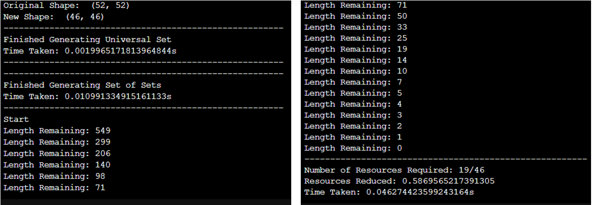

# IdentifyingCodesApproximation

I view the Minimum Identifying Code Set (MICS) problem as a novel variation of the Minimum Hitting Set (MHS) problem. As such, I can utilize the well developed algorithms for the MHS problem, to solve the MICS problem. 

In this repository, I present an approximation algorithm for the MICS problem. This algorithm is based on the well known greedy HS approximation algorithm and has a performance bound of **O(log n)**. 

I have tested my approach on various anonymous undirected Facebook social networks. Even with the **O(log n)** performance bound, on this dataset, the approximation algorithm performed pretty well. It provided *near optimal solution cardinalities in a fraction of the computation time (when compared with an Integer Linear Program).*  

Type `python hittingsetapprox.py` to run the program on an example graph. The output for `3980.edges` is illustrated below. 

1. Original Shape denotes the initial number of nodes in the graph
2. New shape denotes the modified graph after twin-removal (kindly see papers about the idea of twins)
3. The computation times for the creation of the universal and collection sets are displayed. 
4. Length remaining illustrates the cardinality of the set of sets remaining to be hit. 
5. Number of resources required denotes the number of elements of the universal set required to hit all of the sets in the collection set.
6. Resources reduced is a percentage calculation of the resource reduction.
7. Finally, the time taken for the approximate algorithm is displayed. 

For questions, please feel free to reach out to me via email. 
